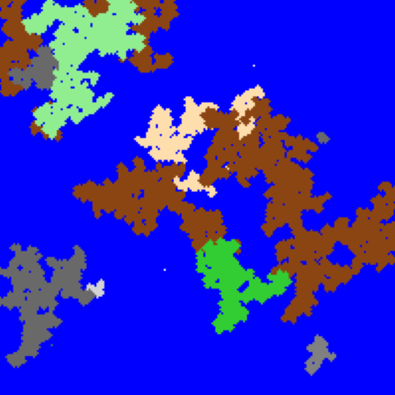

# World Generator

A Python utility for procedurally generating and visualizing 2D grid-based worlds with diverse biomes using a seed-based growth algorithm.



---

## Features

- **Procedural Generation:** Creates 2D grid-based worlds with biome-based terrain.
- **Biome Support:** Includes multiple biomes (e.g., mountains, forests, deserts) with distinct color palettes.
- **Seed-Based Growth:** Uses a growth algorithm to expand biomes from random seed points.
- **Real-Time Visualization:** Displays the world generation process in real-time using Matplotlib.
- **Customizable Parameters:** Adjust grid size, number of seeds, growth probability, and visualization speed.

---

## Installation

1. **Clone the repository:**

   ```bash
   git clone https://github.com/maxy618/world-generator.git
   cd world-generator
   ```

2. **Install dependencies:**

   ```bash
   pip install -r requirements.txt
   ```

---

## Usage

Run the script with:

```bash
python main.py
```

To customize the world generation, modify the parameters in the `generate_world` function call at the end of `main.py`:

```python
generate_world(
    num_rows=100,
    num_cols=100,
    number_of_seeds=10,
    growth_probability=0.57,
    frame_delay=0.001
)
```

- `num_rows` and `num_cols`: Set the grid size.
- `number_of_seeds`: Number of starting points for biome growth.
- `growth_probability`: Probability that a biome spreads to neighboring cells.
- `frame_delay`: Delay between visualization frames (lower values speed up the visualization).

---

## Examples

- **Default Run:** `python main.py` generates a 100x100 world with 10 seeds and a growth probability of 0.57.
- **Larger World:** Try a bigger world with more seeds and faster visualization:

  ```python
  generate_world(
      num_rows=200,
      num_cols=200,
      number_of_seeds=20,
      growth_probability=0.55,
      frame_delay=0.0001
  )
  ```

- **Custom Biomes:** Edit the `BIOMES` dictionary in `biomes.py` to add new biomes or change colors. Each biome’s palette starts with the seed color (depth 0) and transitions to other colors as depth increases.

---

## Requirements

- **Python:** 3.8 or higher
- **Dependencies:** Listed in `requirements.txt`:
  - `numpy`
  - `matplotlib`

---

## How It Works

1. **Initialization:** Creates a grid filled with water.
2. **Seed Placement:** Places random seeds, each linked to a biome.
3. **Growth Process:** Biomes expand from seeds to neighboring cells based on a growth probability, tracking depth from the seed.
4. **Visualization:** Shows the growth in real-time (land in gray), then colors the final world using biome palettes based on depth.
5. **Coloring:** Assigns colors from each biome’s palette, with the first color at the seed and later colors at higher depths.

---

## License

This project is licensed under the MIT License. See the [LICENSE](LICENSE) file for details.

---

## Author

Made with ❤️ by [maxy618](https://github.com/maxy618)